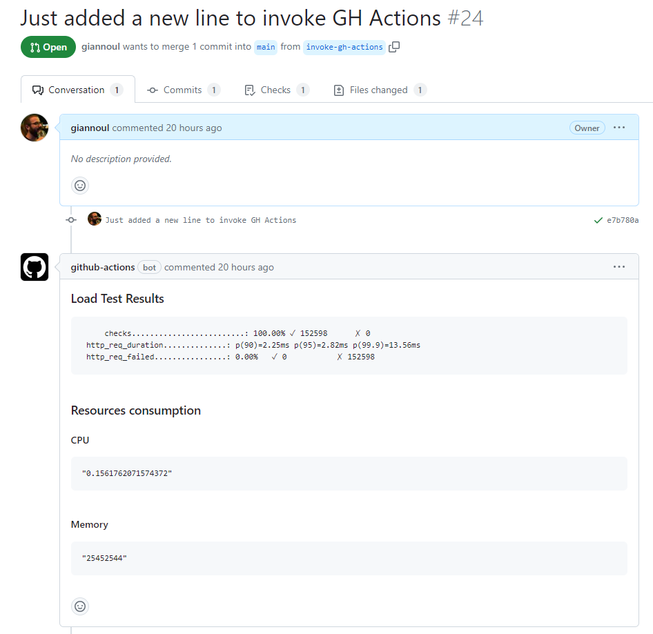

# ci-load-test-challenge
CI Load Test take-home challenge

## Estimated time to complete the assignment ~ 6 hours

## Tools used

### Terraform 
In order to spin up the Kind cluster and create the Kubernetes resources, we utilize Terraform and specifically:
* [kind_cluster](https://registry.terraform.io/providers/tehcyx/kind/latest/docs/resources/cluster): this provider allows us to spin up the Kind cluster
* [kustomization](https://registry.terraform.io/providers/kbst/kustomization/latest/docs): this provider allows us to define the manifests to be applied to the Kubernetes cluster

The Kustomization provider tkaes care of applying the following:
* the nginx ingress controller
* deployments, services and ingress for the foo and bar applications

### Makefile
In order to avoid legthy commands in GitHub Actions, we use a `Makefile` where some auxiliary commands are defined. These commands aim to be used by the GitHub Action workflow steps.

### K6
For the load testing part we utilize [k6](https://k6.io/docs/). It is a simple, yet powerful, load testing tool that exports the required metrics/results.

### Helm
We use Helm in order to install components that need too much configuration if we go to the Kustomization way. So, metrics-server and kube-prometheus are installed using Helm charts nad with just some cli settings to avoid lengthy `values.yaml` files.

## Objectives

> For each pull request to the default branch, trigger the CI workflow. (for example with GitHub Actions)

The GitHub Action for this is located in `.github/workflows/load-test.yml`.

> Provision a multi-node (at least 2 nodes) Kubernetes cluster (you may use KinD to provision this cluster on the CI runner (localhost))

We use the Terraform provider [kind_cluster](https://registry.terraform.io/providers/tehcyx/kind/latest/docs/resources/cluster) in order to spin up 2 nodes (control plane and 1 worker node).

> Deploy Ingress controller to handle incoming HTTP requests

We use the [ingress-nginx](https://github.com/kubernetes/ingress-nginx) which we deploy using the [kustomization](https://registry.terraform.io/providers/kbst/kustomization/latest/docs) Terraform provider.

> Create 2 http-echo deployments, one serving a response of “bar” and another serving a response of “foo”.

The deployments are defined in manifests under the directory `terraform/manifests/`. We use the [kustomization](https://registry.terraform.io/providers/kbst/kustomization/latest/docs) Terraform provider to apply them in the Kind cluster.

> Configure cluster / ingress routing to send traffic for “bar” hostname to the bar deployment and “foo” hostname to the foo deployment on local cluster (i.e. route both http://foo.localhost and http://bar.localhost).

The ingress is defined in `terraform/manifests/foo-bar-ingress.yaml` and is deployed using [kustomization](https://registry.terraform.io/providers/kbst/kustomization/latest/docs).

> Ensure the ingress and deployments are healthy before proceeding to the next step.

In the `Makefile` we have a healthcheck rule named `wait-for-endpoint` which will use curl in order to ensure that the applications are responding. 

> Generate a load of randomized traffic for bar and foo hosts and capture the load testing result

We use [k6](https://k6.io/docs/) to run the load tests with the configuration under `k6-load-test/load-test.js` directory.

> Post the output of the load testing result as comment on the GitHub Pull Request (automated the CI job). Depending on the report your load testing script generates, ideally you'd post stats for http request duration (avg, p90, p95, ...), % of http request failed, req/s handled.

We collect the `k6` test results, store them into a variable and post them as comment in the PR.

> deploy a monitoring solution (prometheus?) for the workload, capture resource utilisation to augment the load testing report

We deploy `prometheus-community/kube-prometheus-stack` and `metrics-server/metrics-server` using Helm. Then, after the load test we collect the query results that regard the CPU and Memory consumption for both applications.

## Result

In the link https://github.com/giannoul/ci-load-test-challenge/pull/24 you may find a run of the GitHub Action workflow with the following result:

